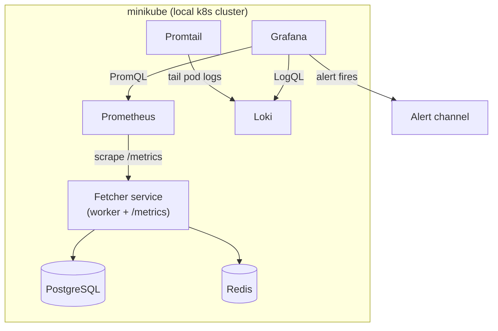

# Beacon — Kubernetes Observability Lab

Deploy a real service to Kubernetes and put it under full observability: metrics, logs, dashboards, and alerting wired to an incident runbook.

**Why this exists:** a focused weekend project to build hands-on Kubernetes + Grafana-stack experience — the gap between "I've read about observability" and "I've run an on-call loop." The app is reused from an existing pipeline (the Sentinel fetcher); the point is the *platform layer*, not the app code.

---

## Architecture



## Stack

| Layer | Tool |
|-------|------|
| Cluster | minikube |
| Packaging | Helm |
| App | Python (FastAPI + prometheus_client) |
| Metrics | Prometheus (`kube-prometheus-stack`) |
| Dashboards / Alerting | Grafana |
| Logs | Loki + Promtail |
| GitOps (stretch) | Argo CD |
| Platform IaC (stretch) | Terraform (helm provider) |

---

## Repo layout

```
beacon/
├── .gitignore          ← Python, Terraform state, Helm deps, secrets, IDE
├── README.md           ← you are here (the build guide)
├── blog.md             ← brief + outline for the Dev.to write-up
├── runbook.md          ← incident runbook (filled in at Phase 5)
├── app/                ← the instrumented service
│   ├── fetcher.py
│   ├── requirements.txt
│   └── Dockerfile
├── k8s/                ← raw manifests (Phase 1)
├── chart/beacon/       ← Helm chart (Phase 2)
├── observability/      ← scrape config, dashboard, alert rule (Phases 3–5)
├── gitops/             ← Argo CD app (Phase 6, stretch)
└── terraform/          ← platform-as-code (Phase 7, stretch)
```

> **Note:** `.terraform/`, `*.tfstate`, `.venv/`, `__pycache__/`, Helm `charts/` deps, and `.env` files are all gitignored. The demo `k8s/secret.yaml` is tracked (placeholder only) — never commit real credentials there.

---

## Build phases

Each phase maps to a real platform skill. Tick them off as you go.

- [ ] **Phase 1 — Run on k8s.** `minikube start`, then `kubectl apply -f k8s/`. Debug with `kubectl get pods` / `logs` / `describe` until all pods are Running. *(Skill: kubectl, workloads/services, configmaps/secrets)*
- [ ] **Phase 2 — Package with Helm.** `helm install beacon ./chart/beacon`. Practice `helm upgrade` and `helm rollback`. *(Skill: Helm)*
- [ ] **Phase 3 — Metrics + dashboard.** Install `kube-prometheus-stack`, scrape `/metrics`, build ONE Grafana dashboard (throughput, p95 latency, error rate). Write the PromQL yourself. *(Skill: Prometheus, Grafana, PromQL, SLIs/SLOs)*
- [ ] **Phase 4 — Logs.** Add Loki + Promtail, add a logs panel, write one LogQL query. *(Skill: Loki, LogQL)*
- [ ] **Phase 5 — Alert + runbook.** One alert rule (error rate > 5% for 5m). Trigger it (`kubectl scale deploy/postgres --replicas=0`), diagnose, fix, then fill in `runbook.md` + a short postmortem. *(Skill: alerting, incidents, runbooks — the most IREN-relevant phase)*
- [ ] **Phase 6 (stretch) — GitOps.** Install Argo CD, point it at this repo, change `values.yaml`, push, watch it sync. *(Skill: Argo CD / GitOps)*
- [ ] **Phase 7 (stretch) — Terraform the platform.** Install the monitoring stack via the Terraform helm provider. *(Skill: IaC)*

## Definition of done

A live demo: service on k8s → Grafana dashboard with metrics + logs → an alert you can trigger on command → a runbook describing the response. Public repo, this README, the diagram.

## Quickstart (Phase 1)

```bash
minikube start
kubectl apply -f k8s/
kubectl get pods -w        # wait for Running
kubectl port-forward svc/fetcher 8000:8000
curl localhost:8000/metrics
```

## Scope discipline

One service. One dashboard. One alert. One runbook. No Tempo/tracing, no second app, no multi-cluster in v1. Ship first, deepen later.
