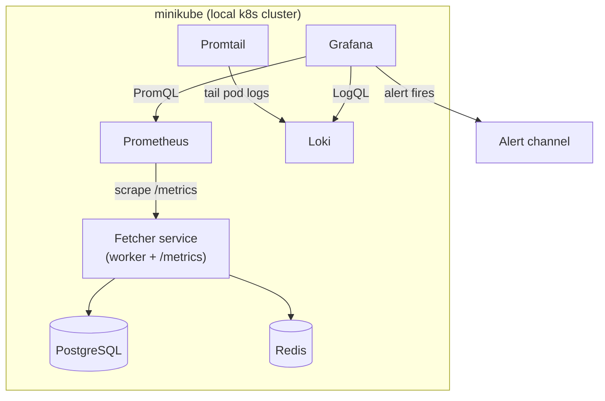

# Beacon — Kubernetes Observability Lab

Deploy a real service to Kubernetes and put it under full observability: metrics, logs, dashboards, and alerting wired to an incident runbook.

**Why this exists:** a focused weekend project to build hands-on Kubernetes + Grafana-stack experience — the gap between "I've read about observability" and "I've run an on-call loop." The app is reused from an existing pipeline (the Sentinel fetcher); the point is the *platform layer*, not the app code.

---

## Architecture



## Stack

| Layer | Tool |
|-------|------|
| Cluster | minikube |
| Packaging | Helm |
| App | Python (FastAPI + prometheus_client) |
| Metrics | Prometheus (`kube-prometheus-stack`) |
| Dashboards / Alerting | Grafana |
| Logs | Loki + Promtail |
| GitOps (stretch) | Argo CD |
| Platform IaC (stretch) | Terraform (helm provider) |

---

## Repo layout

```
beacon/
├── .gitignore          ← Python, Terraform state, Helm deps, secrets, IDE
├── README.md           ← you are here
├── runbook.md          ← incident runbook with real postmortem
├── app/                ← the instrumented service
│   ├── fetcher.py
│   ├── requirements.txt
│   └── Dockerfile
├── k8s/                ← raw manifests (Phase 1)
├── chart/beacon/       ← Helm chart (Phase 2)
├── observability/      ← ServiceMonitor, dashboard JSON, alert rule (Phases 3–5)
├── gitops/             ← Argo CD app (Phase 6, stretch)
└── terraform/          ← platform-as-code (Phase 7, stretch)
```

> **Note:** `.terraform/`, `*.tfstate`, `.venv/`, `__pycache__/`, Helm `charts/` deps, `.env` files, `CLAUDE.md`, and `blog.md` are all gitignored. The demo `k8s/secret.yaml` is tracked (placeholder only) — never commit real credentials there.

---

## What was built

- [x] **Phase 1 — Run on k8s.** Deployed fetcher + Postgres + Redis to minikube with raw manifests. Verified `/metrics` endpoint serving Prometheus counters and histograms.
- [x] **Phase 2 — Package with Helm.** Migrated to Helm chart with `values.yaml`-driven config. Practiced install, upgrade (`--set fetcher.replicas=2`), and rollback.
- [x] **Phase 3 — Metrics + dashboard.** Installed `kube-prometheus-stack`, created a ServiceMonitor, and built a Grafana dashboard with three PromQL panels: throughput (`rate`), p95 latency (`histogram_quantile`), and error rate.
- [x] **Phase 4 — Logs.** Installed Loki + Promtail, added a Loki data source to Grafana, and added a logs panel using LogQL (`{app="fetcher"}`).
- [x] **Phase 5 — Alert + runbook.** Created a `PrometheusRule` (error rate > 5% for 5m). Triggered a real incident by setting `failureRate=0.50` via Helm upgrade. Alert fired, diagnosed via dashboard + logs, resolved by rolling back the config. Wrote a postmortem in `runbook.md`.
- [ ] **Phase 6 (stretch) — GitOps.** Argo CD.
- [ ] **Phase 7 (stretch) — Terraform.** Helm provider IaC.

## Quickstart

```bash
minikube start
minikube image build -t beacon-fetcher:local ./app
helm install beacon ./chart/beacon
kubectl get pods -w        # wait for Running
kubectl port-forward svc/fetcher 8000:8000
curl localhost:8000/metrics
```

## Trigger the alert

```bash
# Crank failure rate to 50%
helm upgrade beacon ./chart/beacon --set fetcher.failureRate=0.50

# Watch the dashboard — error rate spikes, alert fires after 5m
# Then fix it:
helm upgrade beacon ./chart/beacon --set fetcher.failureRate=0.02
```

See `runbook.md` for the full incident response procedure and postmortem.
